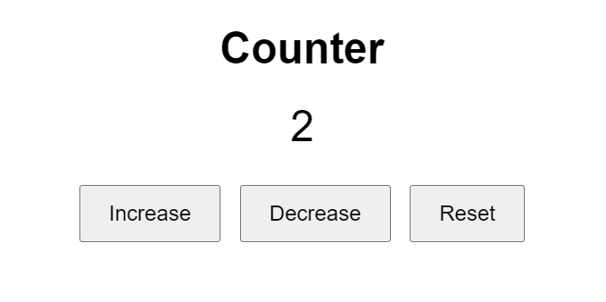

# Interactive-Counter-with-jQuery

## Description
This web page features an interactive counter that allows users to increase, decrease, or reset a numerical value displayed on the page. The page uses HTML, CSS, and jQuery to achieve this functionality. The layout is simple and centered, providing a clean and user-friendly interface.

### Components:

1. **HTML Structure**:
    - **Heading**: A header (`<h1>`) titled "Counter".
    - **Counter Display**: A div (`
`) with the class `counter` to display the current count value.
    - **Buttons**: Three buttons labeled "Increase", "Decrease", and "Reset" for controlling the counter.

2. **CSS Styling**:
    - The page uses a clean, centered design with a large font size for the counter display.
    - Buttons are styled to be visually distinct and easy to click, with padding and margins for spacing.

3. **JavaScript (jQuery)**:
    - **Document Ready**: Ensures the jQuery code runs only after the document is fully loaded.
    - **Button Click Events**: 
        - "Increase" button increments the counter by 1.
        - "Decrease" button decrements the counter by 1.
        - "Reset" button sets the counter back to 0.

### Features:
- **Interactive Counter**: Users can click buttons to adjust the counter value dynamically.
- **Real-Time Updates**: The counter value updates instantly on button clicks.
- **User-Friendly Interface**: Simple and intuitive design for easy interaction.

### Usage:
- **Increase Button**: Click to increment the counter value by 1.
- **Decrease Button**: Click to decrement the counter value by 1.
- **Reset Button**: Click to reset the counter value to 0.

This example provides a straightforward and engaging way to demonstrate basic jQuery functionality and dynamic content updates on a web page.
